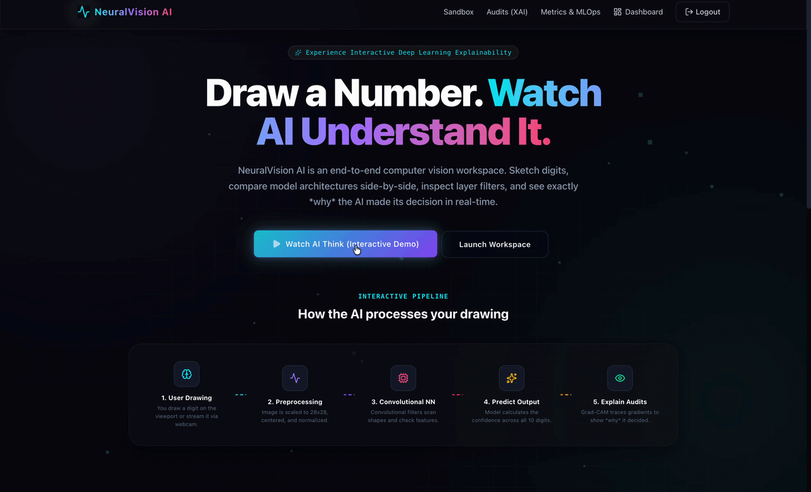
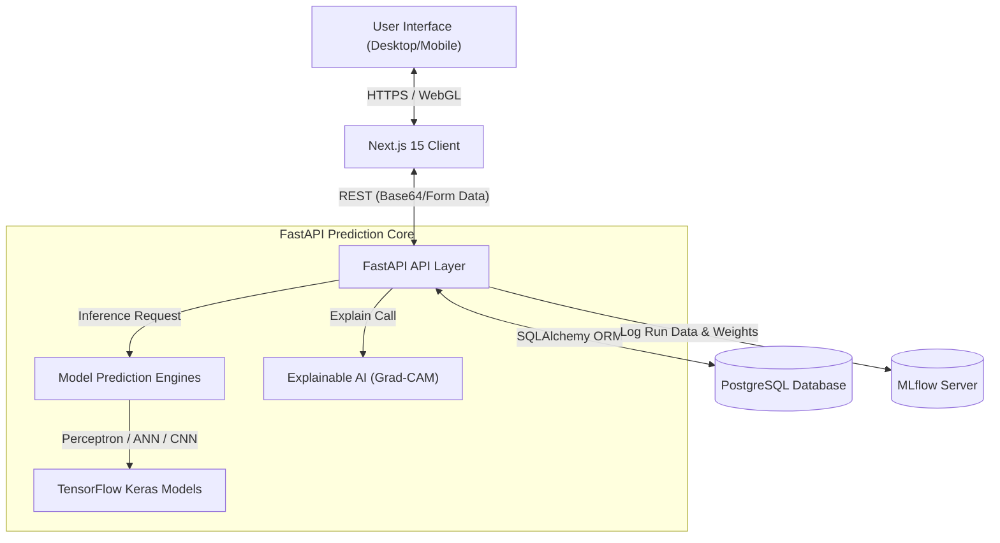
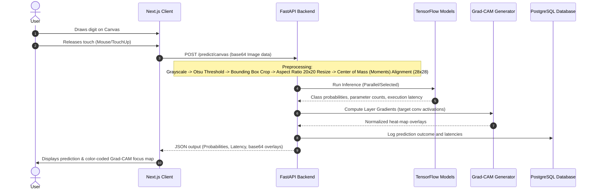
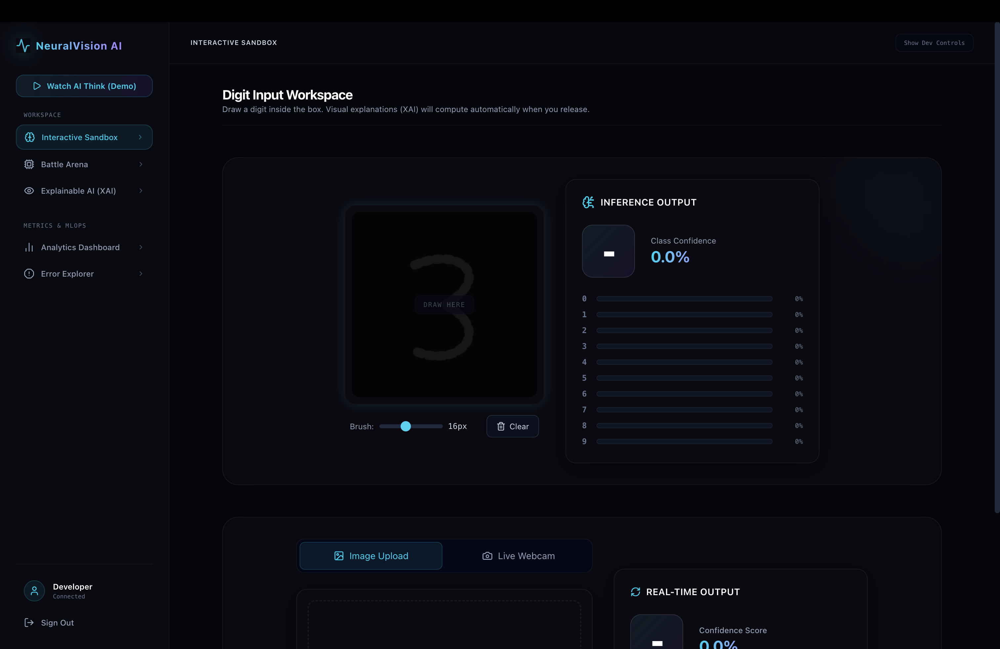
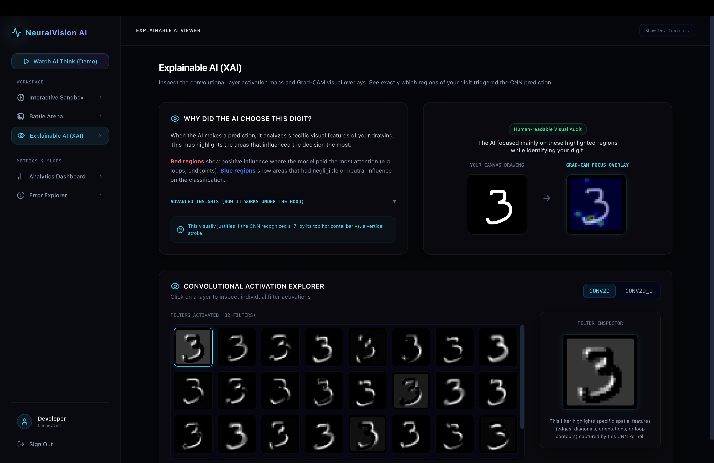
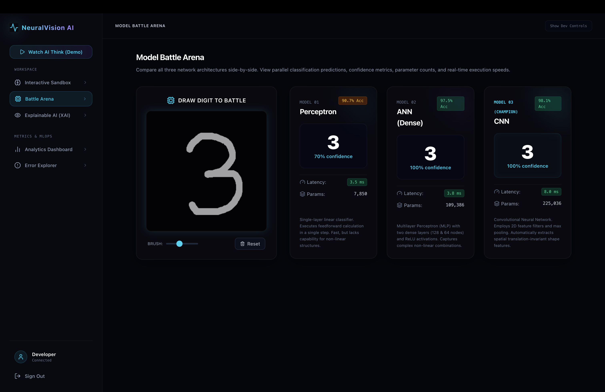
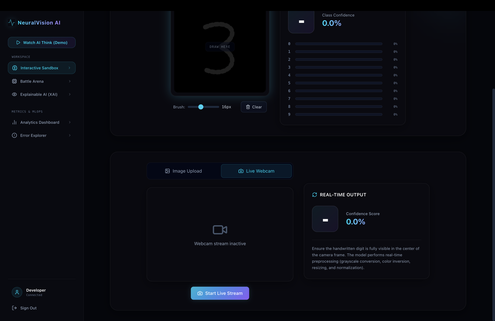
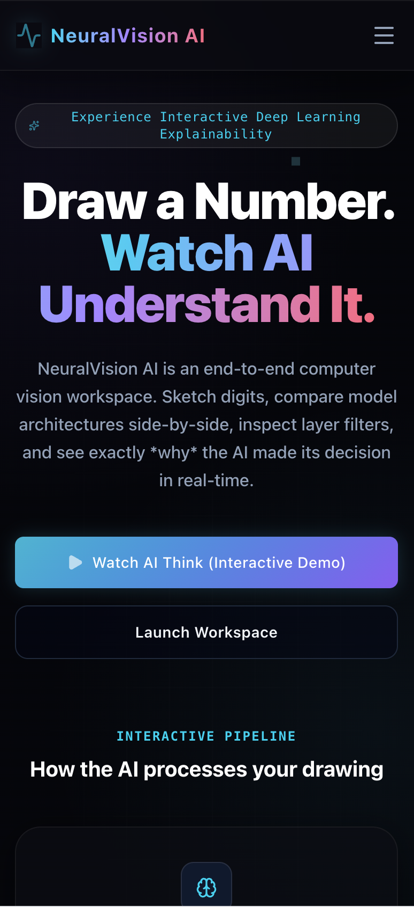

# 👁️ NeuralVision AI

[](https://fastapi.tiangolo.com/)
[](https://nextjs.org/)
[](https://www.tensorflow.org/)
[](https://mlflow.org/)
[](https://www.docker.com/)

An interactive, production-grade computer vision platform and MLOps workspace. Sketch digits, stream webcam feeds, benchmark network architectures, inspect layer activations, and view real-time Explainable AI (XAI) Grad-CAM overlays.

---

## 📽️ Demo Showcase



---

## 🚀 Key Features

* **Interactive Sandbox Drawing**: Clean HTML5 Canvas drawing viewport with responsive stroke resizing and live prediction updates.
* **Explainable AI (XAI) Dash**: Custom **Grad-CAM** implementation highlighting positive class-influence regions (red loops) versus neutral zones (blue backgrounds).
* **Activation Filter Explorer**: View activation maps for every filter inside convolutional layer kernels to see how the AI extracts curves, edges, and shapes.
* **Model Battle Arena**: Run parallel real-time inferences comparing a single-layer **Perceptron**, a Dense **ANN**, and a Deep **CNN** simultaneously, tracking latencies and parameter counts.
* **Webcam & Upload Inference**: Upload image files or stream live video feeds to run real-time digit binarization and classification.
* **MLOps Analytics Dashboard**: View database metrics, digit distributions, and live confusion matrices populated directly from experiment runs.
* **Error Correction Hub**: Audit misclassified prediction logs and submit true labels to update model metrics dynamically.

---

## 📐 System Architecture

### High-Level Topology
This system coordinates a Next.js frontend, an asynchronous FastAPI prediction service, a PostgreSQL database, and an MLflow experiment server in isolated Docker environments.



### Inference & Explainability Data Flow
The sequence diagram below displays the lifecycle of a drawing prediction from canvas stroke to Grad-CAM matrix computation:



---

## 📁 Repository Structure

```text
NeuralVision-AI(CNN)/
├── backend/                       # Python FastAPI Backend
│   ├── app/
│   │   ├── api/                   # Router endpoints (predict, auth, metrics)
│   │   ├── core/                  # Configurations, JWT security, database setups
│   │   ├── db/                    # SQLAlchemy models and migrations
│   │   ├── models/                # Inference service, Keras configurations, Grad-CAM logic
│   │   │   ├── gradcam.py         # Gradient-weighted Class Activation Mapping
│   │   │   └── prediction_service.py # Preprocessing & prediction loading
│   │   └── train.py               # MLflow training pipeline
│   ├── models/                    # Saved Keras model binaries (.keras)
│   ├── Dockerfile                 # Backend Docker build instructions
│   └── requirements.txt           # Python package requirements
├── frontend/                      # Next.js Frontend Application
│   ├── app/                       # App Router pages (Dashboard, Login, Landing)
│   │   ├── dashboard/page.tsx     # Workspace controller panel
│   │   ├── layout.tsx             # Root layout & SEO metadata
│   │   └── globals.css            # Styling and glassmorphic designs
│   ├── components/                # Interactive React components
│   │   ├── Canvas.tsx             # HTML5 canvas drawing engine
│   │   ├── XAIModule.tsx          # Grad-CAM heatmap overlay renderer
│   │   ├── WebcamPredict.tsx      # Video capture and frame captures
│   │   └── AnalyticsDashboard.tsx # Svg charts and confusion matrix
│   ├── Dockerfile                 # Frontend Docker build instructions
│   └── package.json               # Node.js configurations
└── docker-compose.yml             # Orchestration settings (NextJS, FastAPI, MLflow, Postgres)
```

---

## 🛠️ Installation & Local Development

### 🐳 Option A: Production Startup (Docker Compose)
This is the easiest path. Docker will download, build, and link all microservices automatically.

1. **Clone the repository**:
   ```bash
   git clone https://github.com/your-username/NeuralVision-AI.git
   cd NeuralVision-AI
   ```
2. **Build and start containers**:
   ```bash
   docker compose up --build
   ```
3. **Verify endpoints**:
   - **Client App**: `http://localhost:3000`
   - **FastAPI backend**: `http://localhost:8000`
   - **API Docs (Swagger)**: `http://localhost:8000/docs`
   - **MLflow Tracking**: `http://localhost:5005`

---

### 💻 Option B: Manual Development (Local Environment)
If you want to run services locally without Docker (which will fall back to local SQLite databases):

#### 1. Backend Setup:
*Note: Ensure you are running Python 3.10 or 3.11. TensorFlow does not yet have stable pre-built wheels for Python 3.12+ on macOS.*
```bash
cd backend
python3 -m venv venv
source venv/bin/activate
pip install --upgrade pip
pip install -r requirements.txt
uvicorn app.main:app --reload --port 8000
```

#### 2. Run the Training Pipeline:
If you need to train the models from scratch on MNIST and log metrics locally to MLflow:
```bash
cd backend
python -m app.train
```

#### 3. Frontend Setup:
```bash
cd frontend
npm install
npm run dev
```
Navigate to `http://localhost:3000`.

---

## 📟 API Specifications

All endpoints are prefixed with `/api/v1`.

| Method | Endpoint | Description | Payload |
| :--- | :--- | :--- | :--- |
| **POST** | `/auth/signup` | Register a developer account | `{ email, password, name }` |
| **POST** | `/auth/login` | Login and receive a JWT token | `{ username, password }` |
| **POST** | `/predict/canvas` | Predict drawing image with optional Grad-CAM | `{ image_data (base64), model_type, explain }` |
| **POST** | `/predict/battle` | Run prediction parallel across all 3 models | `{ image_data (base64) }` |
| **GET** | `/metrics` | Retrieve runs history and errors table | *None* |
| **POST** | `/metrics/correct`| Submit corrected label to predictive logs | `{ prediction_id, actual_label }` |
| **GET** | `/model-info` | Return model configurations and parameters | *None* |

---

## 📐 Portfolio Screenshots

Here is what the interface looks like across different devices:

### Desktop Dashboard Layout
Capture the main sandbox interface showing the drawing canvas, predicted class, and confidence distribution chart.


### Explainable AI (Grad-CAM) Visuals
Capture the XAI tab showing the original input next to the color-coded Grad-CAM focus overlay.


### Model Battle Arena
Capture the battle arena comparing predictions, parameter counts, and processing speeds.


### Live Webcam Tracking
Capture the Webcam tab showing binarized digit centering from the video camera feed.


### Responsive Viewports (Mobile & Tablet)
Capture the mobile dashboard drawer opened and cards stacked vertically.


---

## 🗺️ Future Roadmap

- [ ] **Real-time Activation Map Animations**: Interactive shaders to show values flowing through network edges.
- [ ] **Custom Convolution Layer Designer**: Let users add/remove layers directly from the web client.
- [ ] **Adversarial Noise Generator**: Add pixel noises to drawings to show how neural networks can be fooled.

---

## 📋 Asset Checklist & Recording Guide

This checklist lists the media files you need to capture to complete this README:

### 1. Screenshots

* **Hero Section Screenshot**
  - **Capture Location**: Landing Page (`http://localhost:3000`)
  - **Recommended Filename**: `assets/screenshots/homepage-hero.png`
  - **Dimensions**: `1920x1080` (Desktop aspect ratio)
  - **Instructions**: Capture the header, animated background, and core CTA buttons.

* **Drawing Canvas Screenshot**
  - **Capture Location**: Sandbox Tab
  - **Recommended Filename**: `assets/screenshots/dashboard-desktop.png`
  - **Dimensions**: `1200x900`
  - **Instructions**: Draw a digit (e.g. `3`) on the canvas and capture the resulting predictions panel.

* **Explainable AI Screenshot**
  - **Capture Location**: XAI Tab
  - **Recommended Filename**: `assets/screenshots/xai-overlay.png`
  - **Dimensions**: `1200x800`
  - **Instructions**: Run a prediction and capture the canvas drawing alongside the Grad-CAM focus overlay.

* **Battle Arena Screenshot**
  - **Capture Location**: Battle Arena Tab
  - **Recommended Filename**: `assets/screenshots/battle-arena.png`
  - **Dimensions**: `1200x950`
  - **Instructions**: Draw a digit to run all 3 models and capture the comparison cards.

* **Webcam Predictor Screenshot**
  - **Capture Location**: Sandbox Webcam View
  - **Recommended Filename**: `assets/screenshots/webcam-stream.png`
  - **Dimensions**: `1200x800`
  - **Instructions**: Activate the webcam feed and show a handwritten digit.

* **Mobile Viewport Screenshot**
  - **Capture Location**: Mobile view simulation
  - **Recommended Filename**: `assets/screenshots/dashboard-mobile.png`
  - **Dimensions**: `390x844` (iPhone portrait aspect ratio)
  - **Instructions**: Simulate phone layout with sidebar drawer opened.

---

### 2. Demo GIF

* **Main Session Demonstration**
  - **Recommended Filename**: `assets/demo/demo-session.gif`
  - **Duration**: `10 - 15 seconds`
  - **Recommended Tool**: [LICEcap](https://www.cockos.com/licecap/) (Mac/Windows) or native Mac screen capture (`Cmd + Shift + 5` to record video, then convert via `ffmpeg`).
  - **Actions to Record**:
    1. Click "Watch AI Think (Demo)" on the sidebar.
    2. Record the automatic drawing of digit `3` on the canvas.
    3. Watch the prediction return in real-time.
    4. Automatically jump to the XAI tab and show the Grad-CAM overlay loading.
  - **README Placement**: Under the "Demo Showcase" section.

---

## 🛠️ Manual Tasks Remaining

Before publishing this repository to GitHub, perform these steps:

1. [ ] **Capture screenshots and GIFs** listed in the **Asset Checklist** above.
2. [ ] **Create the asset directories** inside the root folder:
   ```bash
   mkdir -p assets/screenshots assets/demo
   ```
3. [ ] **Save the captured files** to their respective folders using the recommended filenames.
4. [ ] **Push the project code** to your public GitHub repository.
