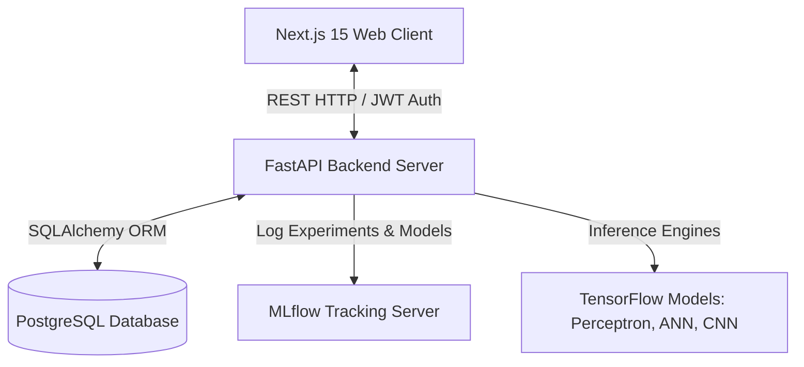

# NeuralVision AI


NeuralVision AI is a production-grade, end-to-end deep learning platform and microservices ecosystem designed for handwritten digit classification, real-time performance benchmarking, and neural network explainability.

Designed with a sleek, high-fidelity dark-mode interface, the platform features drawing canvas inputs, live webcam feed classification, parallel model analysis (Model Battle Arena), intermediate conv-layer activation visualizers, and experiment tracking powered by MLflow and PostgreSQL.

---

## System Architecture



### Data Flow

1. **Input Stage**: The user draws a digit on the canvas, uploads a PNG/JPG, or activates the live webcam feed.
2. **Preprocessing**: The client sends the image as a base64 data URI or file upload. The FastAPI backend decodes the data, converts it to grayscale, resizes it to $28 \times 28$, computes background/foreground illumination to automatically invert colors to match the MNIST format (white digit on a black background), and normalizes pixel values to $[0, 1]$.
3. **Inference**: The preprocessed array is sent to the target models (Perceptron, ANN, or CNN) running TensorFlow.
4. **Explainability**: If using the CNN model, the backend targets the final convolutional layer to generate a Grad-CAM heatmap showing the spatial areas triggering the classification. It also extracts activation maps from the intermediate layers.
5. **Storage**: The classification results, latency times, and base64 input details are persisted in the PostgreSQL database.
6. **Analytics**: Real-time stats, historical training curves, and confusion matrices are retrieved from the database and MLflow configurations.

---

## Tech Stack

### Frontend
- **Framework**: Next.js 15 (App Router, TypeScript)
- **Styling**: TailwindCSS & custom Vanilla CSS tokens (glassmorphic layout, glowing neons)
- **Animations**: Framer Motion
- **3D Graphics**: Three.js & React Three Fiber

### Backend
- **Framework**: FastAPI (Python 3.10)
- **Deep Learning**: TensorFlow (Keras API)
- **Science/Data**: NumPy, Pandas, OpenCV, Scikit-Learn
- **Experiment Tracking**: MLflow
- **Database ORM**: SQLAlchemy

### Database & Deployment
- **Database**: PostgreSQL
- **Containerization**: Docker & Docker Compose
- **CI/CD**: GitHub Actions

---

## Database Schema

```
+------------------------------------+
|                Users               |
+------------------------------------+
| id (PK)         : Integer          |
| email (Unique)  : String(255)      |
| name            : String(255)      |
| hashed_password : String(255)      |
| created_at      : DateTime         |
+------------------------------------+
                  | 1
                  |
                  | 0..*
+------------------------------------+
|          PredictionHistory         |
+------------------------------------+
| id (PK)         : Integer          |
| user_id (FK)    : Integer          |
| image_data      : Text (Base64)    |
| model_type      : String(50)       |
| predicted_label : Integer          |
| actual_label    : Integer (Null)   |
| confidence      : Float            |
| all_confidences : JSON (List)      |
| inference_time  : Float (ms)       |
| source          : String(50)       |
| created_at      : DateTime         |
+------------------------------------+
                  | 1
                  |
                  | 0..*
+------------------------------------+
|           BattleArenaLog           |
+------------------------------------+
| id (PK)         : Integer          |
| user_id (FK)    : Integer          |
| image_data      : Text (Base64)    |
| actual_label    : Integer (Null)   |
| perp_predicted  : Integer          |
| perp_confidence : Float            |
| perp_latency_ms : Float            |
| ann_predicted   : Integer          |
| ann_confidence  : Float            |
| ann_latency_ms  : Float            |
| cnn_predicted   : Integer          |
| cnn_confidence  : Float            |
| cnn_latency_ms  : Float            |
| created_at      : DateTime         |
+------------------------------------+
```

---

## API Documentation

All routes are prefixed by `/api/v1`.

### Authentication
- `POST /auth/signup`: Registers a new user. Expects JSON `{ "email", "password", "name" }`.
- `POST /auth/login`: Authenticates user credentials and returns a JWT access token.
- `GET /auth/me`: Retrieves current authenticated user metadata.

### Prediction
- `POST /predict`: Classifies a digit. Expects JSON `{ "image_data", "source", "model_type" }`. Returns classification labels, class probabilities, execution latency, Grad-CAM overlays, and activation filter maps.
- `POST /predict/canvas`: Specialized prediction endpoint optimized for drawing canvas data inputs.
- `POST /predict/image`: Accepts multipart form uploads (`file`) of custom drawings.
- `POST /predict/battle`: Classifies a single input using all three models (Perceptron, ANN, and CNN) simultaneously, returning comparative latencies and predictions.

### Metrics & Analytics
- `GET /metrics`: Returns training loss/accuracy history, evaluation confusion matrices, and interactive system stats.
- `POST /metrics/correct`: Logs the true actual label of a classification instance to update the error hub.
- `GET /model-info`: Returns structured specifications of loaded models, layer configs, optimizers, and parameter counts.

---

## Setup & Local Development

Ensure you have [Docker](https://www.docker.com/) and [Docker Compose](https://docs.docker.com/compose/) installed.

### 1. Launch with Docker Compose
To build and start the entire stack (PostgreSQL, MLflow, FastAPI backend, Next.js frontend):
```bash
# First-time build or when modifying dependency configurations
docker compose up --build

# Subsequent fast launches (rebuilds only modified code in seconds, reuses package caches)
docker compose up
```

Once the containers are active:
- **Frontend App**: `http://localhost:3000`
- **FastAPI API Server**: `http://localhost:8000`
- **Swagger API Docs**: `http://localhost:8000/docs`
- **MLflow Dashboard**: `http://localhost:5005`

> [!NOTE]
> **macOS Port Conflict**: MLflow is exposed on host port `5005` because macOS Monterey and newer binds its native **AirPlay Receiver** to port `5000` by default. Internally within the Docker network, backend containers still connect via port `5000`.

> [!TIP]
> **Hot Reloading**: The backend uses volume mounts. Any local changes made to python files under the `backend/` folder are instantly updated in the container in real-time without needing a container rebuild or restart.

### 2. Manual Development Setup

If running components natively without Docker (SQLite fallback mode):

#### Backend Setup:
Ensure you are using Python 3.10 or 3.11 (TensorFlow has compatibility issues on Python 3.12+ for macOS):
```bash
cd backend
python3 -m venv venv
source venv/bin/activate
pip install --upgrade pip
pip install -r requirements.txt
uvicorn app.main:app --reload --port 8000
```

#### Running the Training Pipeline:
To train the models from scratch on the MNIST CSV files and log variables to MLflow:
```bash
cd backend
python -m app.train
```

#### Frontend Setup:
```bash
cd frontend
npm install
npm run dev
```

---

## MLOps & Experiment Tracking

The `backend/app/train.py` script trains a Perceptron, a Multilayer Artificial Neural Network (ANN), and a Convolutional Neural Network (CNN) in sequence. It automatically logs metrics (Validation Loss, Validation Accuracy, Precision, Recall, F1-Score) per epoch to the local MLflow server. Model checkpoints (`.keras` format) are logged directly to the MLflow artifact store and loaded dynamically by the FastAPI prediction service on launch.
